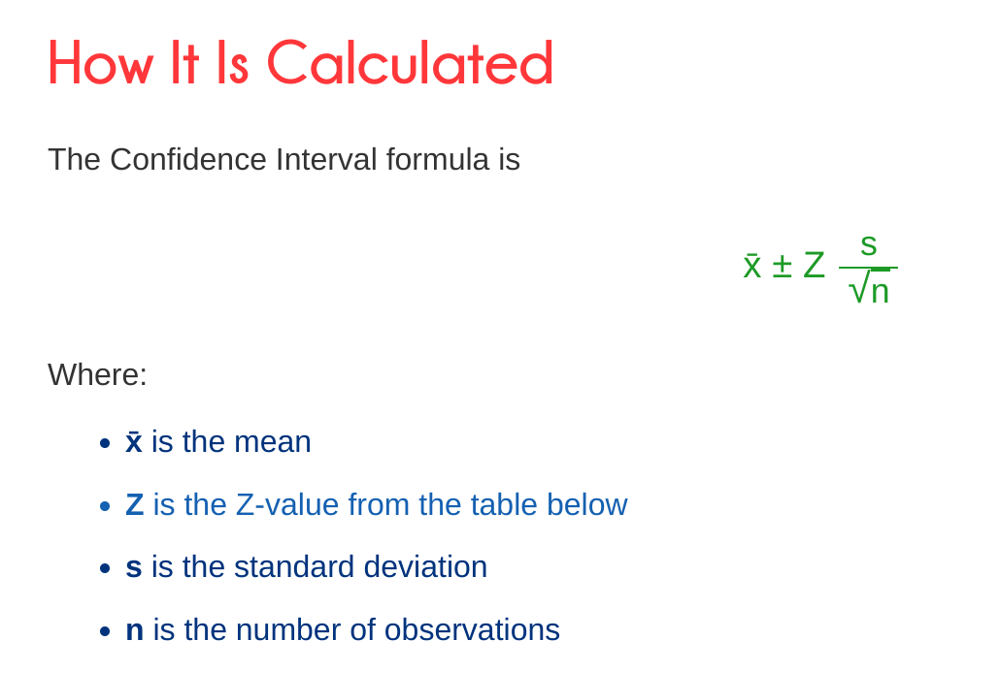

<h1>
  <p align="center">
    Synchronization and Parallel Programming</br>TP 3 & 4
  </p>
</h1>
<p align="center">
</br>
  By <b>Cody ADAM</b> & <b>Benjamin DE ZORDO</b>
</p>

- [1. Project structure](#1-project-structure)
- [2. Code explanation](#2-code-explanation)
  - [TODO](#todo)
- [3. Performance Analysis](#3-performance-analysis)
  - [Speed comparison per number of threads on the same image](#speed-comparison-per-number-of-threads-on-the-same-image)
  - [Speed comparison per image size on the same number of threads (k=4)](#speed-comparison-per-image-size-on-the-same-number-of-threads-k4)


# 1. Project structure

```
📦SPP_TP_3_4
 ┣ 📂doc                               # Documentation related files
 ┃ ┗ 📜graph_from_results.ipynb        # Jupyter notebook to generate graphs
 ┣ 📂OUR_IMAGES                        # Output images
 ┣ 📂TEST_IMAGES                       # Input images
 ┣ 📂lib
 ┃ ┗ 📜junit-4.11.jar
 ┣ 📂src
 ┃ ┣ 📂engine                                        # Engine related
 ┃ ┃ ┣ 📜IImageFilteringEngine.java
 ┃ ┃ ┣ 📜MultiThreadedImageFilteringEngine.java
 ┃ ┃ ┗ 📜SingleThreadedImageFilteringEngine.java
 ┃ ┣ 📂filters                                       # Filters related
 ┃ ┃ ┣ 📜ExampleFilter.java
 ┃ ┃ ┣ 📜FilterUtils.java
 ┃ ┃ ┣ 📜GaussianContourExtractorFilter.java
 ┃ ┃ ┣ 📜GrayLevelFilter.java
 ┃ ┃ ┗ 📜IFilter.java
 ┃ ┣ 📂runner                                        # Main classes that run the program
 ┃ ┃ ┣ 📜PerformanceAnalysis.java
 ┃ ┃ ┗ 📜SimpleImageProcessingExample.java
 ┃ ┗ 📂test                                          # Unit tests
 ┃ ┃ ┗ 📜FiltersTests.java
 ┣ 📜ESIR_SPP_TP_3_4_New_2023.pdf
 ┗ 📜README.md
 ```
# 2. Code explanation

## TODO

# 3. Performance Analysis

The data was generated by the `📜PerformanceAnalysis.java` class and the graphs were generated by the `📜graph_from_results.ipynb` Jupyter notebook.

The results are in milliseconds and the **confidence interval is 95%**.



*source : https://www.mathsisfun.com/data/confidence-interval-calculator.html*

## 3.1. Speed comparison per number of threads on the same image 

- The image is 1920x1080 pixels. (**2073600 pixels**)
- `k` is the number of threads.
- The speed is the average of 10 runs.

| Engine              | GrayLevelFilter | GaussianContourExtractorFilter |
| ------------------- | --------------- | ------------------------------ |
| Single Thread       | 80ms            | 19679ms                        |
| Multi Thread (k=1)  | 80ms            | 19532ms                        |
| Multi Thread (k=2)  | 53ms            | 10382ms                        |
| Multi Thread (k=3)  | 51ms            | 8019ms                         |
| Multi Thread (k=4)  | 43ms            | 6683ms                         |
| Multi Thread (k=5)  | 38ms            | 5858ms                         |
| Multi Thread (k=6)  | 35ms            | 5191ms                         |
| Multi Thread (k=7)  | 35ms            | 5005ms                         |
| Multi Thread (k=8)  | 31ms            | 4931ms                         |
| Multi Thread (k=9)  | 33ms            | 4917ms                         |
| Multi Thread (k=10) | 33ms            | 4916ms                         |

**Graphic representation of the results :**


## 3.2. Speed comparison per image size on the same number of threads (k=4)

- `n` is the number of pixels.
- The speed is the average of 10 runs.

| Image size                               | GrayLevelFilter | GaussianContourExtractorFilter |
| ---------------------------------------- | --------------- | ------------------------------ |
| 15226222451_75d515f540_o.jpg (n=2073600) | 42ms            | 6624ms                         |
| 15226222451_a49b1a624b_h.jpg (n=1440000) | 31ms            | 4670ms                         |
| 15226222451_5fd668d81a_c.jpg (n=360000)  | 8ms             | 1216ms                         |
| 15226222451_5fd668d81a_z.jpg (n=230400)  | 4ms             | 795ms                          |
| 15226222451_5fd668d81a.jpg (n=140500)    | 3ms             | 487ms                          |
| 15226222451_5fd668d81a_n.jpg (n=57280)   | 1ms             | 202ms                          |
| 15226222451_5fd668d81a_m.jpg (n=32160)   | 0ms             | 117ms                          |
| 15226222451_5fd668d81a_t.jpg (n=5600)    | 0ms             | 19ms                           |

# 4. Challenges & limitations

1. The times depend on your machine and the number of cores you have.
2. If we want to run the analysis, it takes a lot of time since we are running multiple times to compute the average. It takes about 5 minutes.

