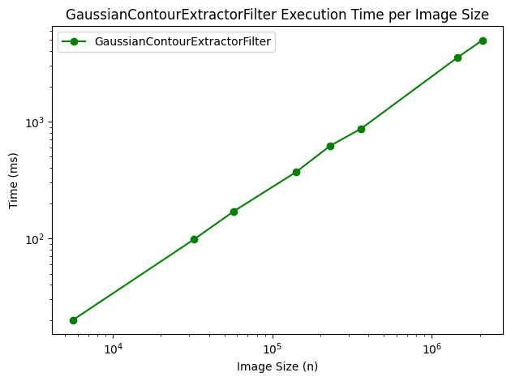

<h1>
  <p align="center">
    Synchronization and Parallel Programming</br>TP 3 & 4
  </p>
</h1>
<p align="center">
</br>
  By <b>Cody ADAM</b> & <b>Benjamin DE ZORDO</b>
</p>

- [1. Project structure](#1-project-structure)
- [2. Code explanation](#2-code-explanation)
- [3. Performance Analysis](#3-performance-analysis)
  - [3.1. Speed comparison per number of threads on the same image](#31-speed-comparison-per-number-of-threads-on-the-same-image)
  - [3.2. Speed comparison per image size on the same number of threads (k=4)](#32-speed-comparison-per-image-size-on-the-same-number-of-threads-k4)
- [4. Challenges \& Limitations](#4-challenges--limitations)


# 1. Project structure

```
📦SPP_TP_3_4
 ┣ 📂doc                               # Documentation related files
 ┃ ┗ 📜graph_from_results.ipynb        # Jupyter notebook to generate graphs
 ┣ 📂OUR_IMAGES                        # Output images
 ┣ 📂TEST_IMAGES                       # Input images
 ┣ 📂lib
 ┃ ┗ 📜junit-4.11.jar
 ┣ 📂src
 ┃ ┣ 📂engine                                        # Engine related
 ┃ ┃ ┣ 📜IImageFilteringEngine.java
 ┃ ┃ ┣ 📜MultiThreadedImageFilteringEngine.java
 ┃ ┃ ┗ 📜SingleThreadedImageFilteringEngine.java
 ┃ ┣ 📂filters                                       # Filters related
 ┃ ┃ ┣ 📜ExampleFilter.java                          # Filter given in the TP
 ┃ ┃ ┣ 📜FilterUtils.java
 ┃ ┃ ┣ 📜GaussianContourExtractorFilter.java
 ┃ ┃ ┣ 📜GrayLevelFilter.java
 ┃ ┃ ┗ 📜IFilter.java
 ┃ ┣ 📂runner                                        # Main classes that run the program
 ┃ ┃ ┣ 📜PerformanceAnalysis.java
 ┃ ┃ ┗ 📜SimpleImageProcessingExample.java           # Execution example given in the TP
 ┃ ┗ 📂test                                          # Unit tests
 ┃ ┃ ┗ 📜FiltersTests.java
 ┣ 📜ESIR_SPP_TP_3_4_New_2023.pdf
 ┗ 📜README.md
 ```
# 2. Code explanation

We made sure that the code was as clear and readable as possible.

**The code is self-explanatory and commented where necessary. In this section, we will only describe some notes that explain our decisions :**

1. **Part 1: The single-thread engine and filters** :
   - To implement the filters, we had to often use the RGB values of the pixels. And since the value was encoded in an `int`, it was time-consuming to extract the RGB values. To solve this problem, we created a utility class `FilterUtils` that contains methods to extract the RGB values of a pixel. This class extends the `IFilter` class. This is why all our filters extend the `FilterUtils` class.
   - In each filter and engine implementation, we added a main method to test the class.
2. **Part 2: The multi-thread engine** :
   - To share the work between threads we split the image by group of rows. Each thread is responsible for a group of rows. 
   - We make sure that if the number of rows is not divisible by the number of threads, the last thread will have more rows to process.
   - We also make sure that the number of threads is not greater than the number of rows.
   - For concurrency, we used a barrier to synchronize the threads. The barrier is used to block the main thread until all the threads have finished processing the image.
3. **Part 3: The analysis of the performance** :
   - The `PerformanceAnalysis` class is used to generate the data for the performance analysis. It computes the average of 10 runs for each filter and each image with a confidence interval of 95%. The results are printed in the console as a markdown table.
   - The table is then used by the `graph_from_results.ipynb` Jupyter notebook to generate the images of the graphs shown below.
4. **Unit tests of the filters** :
   - To test the filters, we created a `FiltersTests` class using JUnit. Here we perform unit tests on the filters. What we do is a comparison between the output of the filter and the expected output image. To do this we only use the single-thread engine.
   - Then we also want to test the multi-thread engine. To do this, we compare the output of the multi-thread engine with the output of the single-thread engine (already tested before). We do this for each filter and each image. We also test the multi-thread engine with different numbers of threads.


# 3. Performance Analysis

The data was generated by the `📜PerformanceAnalysis.java` class and the graphs were generated by the `📜graph_from_results.ipynb` Jupyter notebook.

The results are in milliseconds and the **confidence interval is 95%**.

the confidence interval formula is :

$$
\bar x \pm 1.96 \frac{s}{\sqrt{n}}
$$

Where :
- $\bar x$ is the mean of the sample
- 1.96 is the value of the normal distribution at 95% confidence
- $s$ is the standard deviation of the sample
- $n$ is the number of elements in the sample

*source: https://www.mathsisfun.com/data/confidence-interval-calculator.html*

## 3.1. Speed comparison per number of threads on the same image 

- The image is 1920x1080 pixels. (**2073600 pixels**)
- `k` is the number of threads.
- The speed is the average of 10 runs.

| Engine              | GrayLevelFilter | GaussianContourExtractorFilter |
| ------------------- | --------------- | ------------------------------ |
| Single Thread       | 103 ± 15ms      | 23478 ± 402ms                  |
| Multi Thread (k=1)  | 100 ± 6ms       | 23832 ± 456ms                  |
| Multi Thread (k=2)  | 66 ± 6ms        | 12769 ± 234ms                  |
| Multi Thread (k=3)  | 49 ± 2ms        | 8779 ± 56ms                    |
| Multi Thread (k=4)  | 41 ± 2ms        | 6682 ± 375ms                   |
| Multi Thread (k=5)  | 36 ± 2ms        | 4731 ± 38ms                    |
| Multi Thread (k=6)  | 33 ± 3ms        | 4566 ± 10ms                    |
| Multi Thread (k=7)  | 31 ± 3ms        | 4238 ± 27ms                    |
| Multi Thread (k=8)  | 25 ± 2ms        | 4079 ± 27ms                    |
| Multi Thread (k=9)  | 29 ± 2ms        | 4114 ± 33ms                    |
| Multi Thread (k=10) | 31 ± 3ms        | 4114 ± 20ms                    |

**Graphic representation of the results :**


Both of the curves are very similar with an inverted logarithmic shape. 

We can see the speed difference between the `GrayLevelFilter` and the `GaussianContourExtractorFilter`. The `GaussianContourExtractorFilter` is much slower than the `GrayLevelFilter` which is normal because it is a more complex filter with more iterations per pixel.

The duration of the computation between the `Single thread` and the `Multi thread (k=1)` is almost identical. This is to be expected because the `Multi thread (k=1)` engine is the same as a single-thread engine.

The computation time decreases very quickly with the number of threads. But it then converges logarithmically to a constant value. There won't be great differences between the `Multi thread (k=8)` and the `Multi thread (k=10)`. At some point the time required on the main thread to manage the threads will be greater than the time saved by the threads, which makes the curve converge to a constant value.


***Note:** The first graph's curve with the `GrayLevelFilter` is a little bit wobbly and rougher than the other curves. This is due to the duration of the computation being very small and the time measurement, therefore, has a higher variance, even after the average of 10 runs.*


## 3.2. Speed comparison per image size on the same number of threads (k=4)

- `n` is the number of pixels.
- The speed is the average of 10 runs.
- The number of threads is 4.

| Image size                               | GrayLevelFilter | GaussianContourExtractorFilter |
| ---------------------------------------- | --------------- | ------------------------------ |
| 15226222451_75d515f540_o.jpg (n=2073600) | 41 ± 2ms        | 4986 ± 30ms                    |
| 15226222451_a49b1a624b_h.jpg (n=1440000) | 28 ± 1ms        | 3527 ± 69ms                    |
| 15226222451_5fd668d81a_c.jpg (n=360000)  | 8 ± 1ms         | 872 ± 17ms                     |
| 15226222451_5fd668d81a_z.jpg (n=230400)  | 5 ± 0ms         | 622 ± 57ms                     |
| 15226222451_5fd668d81a.jpg (n=140500)    | 3 ± 0ms         | 370 ± 14ms                     |
| 15226222451_5fd668d81a_n.jpg (n=57280)   | 2 ± 0ms         | 171 ± 13ms                     |
| 15226222451_5fd668d81a_m.jpg (n=32160)   | 1 ± 0ms         | 98 ± 5ms                       |
| 15226222451_5fd668d81a_t.jpg (n=5600)    | 1 ± 0ms         | 20 ± 2ms                       |




***Note:** We had to plot the results using a logarithmic scale to improve the readability of the graphs.
If we don't use a logarithmic scale, we can't clearly see the smaller values.*

For the X-axis, we used the number of pixels in the image which is the multiplication of the width and the height of the image.

For the Y axis, we used the time in milliseconds.


For the first filter, the `GrayLevelFilter`, we can see that the speed is almost constant at 0ms for the smallest images and then the speed increases linearly with the number of pixels. This is due to the computation time of the filter which is almost instant for small images.

For the second filter, the `GaussianContourExtractorFilter` takes more time to compute. That's why we don't see the same behavior as the first filter and the speed increases linearly with the number of pixels.

***Note:** The same way as in `part 3.1.`, the first graph's curve with the `GrayLevelFilter` is a little bit wobbly and less straight than the other curves. This is due to the duration of the computation being very small and the time measurement, therefore, has a higher variance, even after the average of 10 runs.*


# 4. Challenges & Limitations

1. The time's benchmarks depend on the computer's performance. The results may vary from one computer to another.
2. If we want to run the analysis, it takes a lot of time since we are running multiple times to compute the average. It takes about 15-20 minutes for 10 runs. This was a little bit annoying for trying different things.

